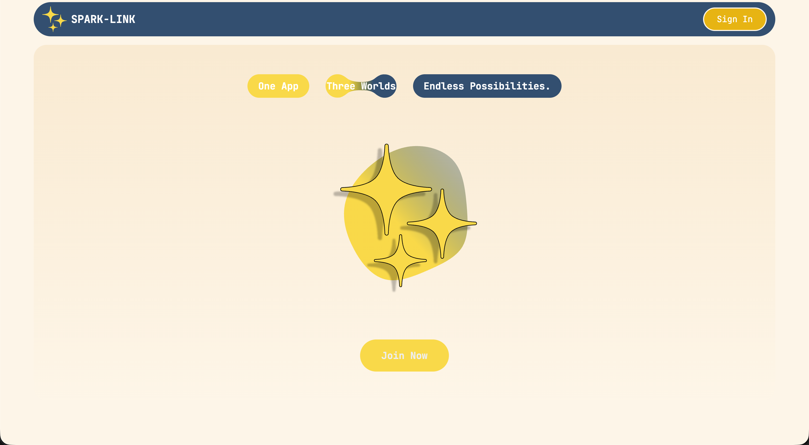

# SparkLink

SparkLink is a modern web app that connects users and lets them share interactive content in real time.

[Live Demo](https://spark-link-app.vercel.app/)

## Features

User authentication with AWS Cognito

Match and add friends

Share and watch videos posted by users

PayPal integration for payments

GPT-4o-mini integration for AI-powered features

Real-time notifications and interactive content

## Requirements

Node.js v20+

npm v10+

A Supabase account and credentials

OpenAI API key

PayPal developer account

## Installation

### Clone the repository
git clone https://github.com/P0stt3mp3stAs/SparkLink.git
cd SparkLink

### Install dependencies
npm install

### Create environment variable files

Create .env and .env.local in the root directory and include:

#### OIDC Authentication
NEXT_PUBLIC_OIDC_AUTHORITY=
NEXT_PUBLIC_OIDC_CLIENT_ID=
NEXT_PUBLIC_OIDC_REDIRECT_URI=
NEXT_PUBLIC_OIDC_LOGOUT_URI=

#### Database / Supabase
DATABASE_URL=
SUPABASE_SERVICE_ROLE_KEY=
SUPABASE_URL=
NEXT_PUBLIC_SUPABASE_URL=
NEXT_PUBLIC_SUPABASE_ANON_KEY=
NEXT_PUBLIC_SUPABASE_BUCKET=

#### PayPal
PAYPAL_CLIENT_ID=
PAYPAL_CLIENT_SECRET=
NEXT_PUBLIC_PAYPAL_CLIENT_ID=
PAYPAL_MODE=

#### OpenAI
OPENAI_API_KEY=
OPENAI_ORG_ID=

Keep all secret keys private. Do not commit .env files.

## Usage
npm run dev       # Start development server
npm run build     # Build production app
npm start         # Run production server

Then open http://localhost:3000

### Database Schema

Below are the main tables used by SparkLink.
These represent the current structure in Supabase/PostgreSQL.

#### profiles
    Column     |           Type           | Collation | Nullable |               Default
---------------+--------------------------+-----------+----------+--------------------------------------
 id            | integer                  |           | not null | nextval('profiles_id_seq'::regclass)
 user_id       | uuid                     |           | not null |
 username      | text                     |           | not null |
 name          | text                     |           | not null |
 email         | text                     |           | not null |
 phone         | text                     |           |          |
 country       | text                     |           |          |
 date_of_birth | date                     |           |          |
 gender        | text                     |           |          |
 images        | text[]                   |           |          | '{}'::text[]
 created_at    | timestamp with time zone |           |          | now()

#### videos
   Column    |           Type           | Collation | Nullable |      Default
-------------+--------------------------+-----------+----------+--------------------
 id          | uuid                     |           | not null | uuid_generate_v4()
 user_id     | text                     |           | not null |
 video_url   | text                     |           | not null |
 description | text                     |           |          |
 likes       | integer                  |           |          | 0
 shares      | integer                  |           |          | 0
 comments    | jsonb                    |           |          | '[]'::jsonb
 created_at  | timestamp with time zone |           |          | now()
 liked_by    | text[]                   |           |          | '{}'::text[]
 shared_by   | text[]                   |           |          | '{}'::text[]

#### friends
 Column  |  Type   | Collation | Nullable |               Default
---------+---------+-----------+----------+-------------------------------------
 id      | integer |           | not null | nextval('friends_id_seq'::regclass)
 user_id | uuid    |           | not null |
 friends | uuid[]  |           |          | '{}'::uuid[]

#### match
 Column  |  Type   | Collation | Nullable |              Default
---------+---------+-----------+----------+-----------------------------------
 id      | integer |           | not null | nextval('match_id_seq'::regclass)
 user_id | uuid    |           | not null |
 matches | uuid[]  |           |          | '{}'::uuid[]

#### dismatch
   Column   |  Type   | Collation | Nullable |               Default
------------+---------+-----------+----------+--------------------------------------
 id         | integer |           | not null | nextval('dismatch_id_seq'::regclass)
 user_id    | uuid    |           | not null |
 dismatches | uuid[]  |           |          | '{}'::uuid[]

#### messages
    Column    |           Type           | Collation | Nullable |      Default
--------------+--------------------------+-----------+----------+-------------------
 id           | uuid                     |           | not null | gen_random_uuid()
 sender_id    | uuid                     |           | not null |
 receiver_id  | uuid                     |           | not null |
 content      | text                     |           | not null |
 timestamp    | timestamp with time zone |           |          | now()
 type         | text                     |           |          | 'normal'::text
 scheduled_at | timestamp with time zone |           |          |
 sent         | boolean                  |           |          | true

#### notifications
    Column    |  Type   | Collation | Nullable |                  Default
--------------+---------+-----------+----------+-------------------------------------------
 id           | integer |           | not null | nextval('notifications_id_seq'::regclass)
 user_id      | uuid    |           | not null |
 from_user_id | uuid    |           | not null |
 is_read      | boolean |           |          | false

#### user_details
   Column    |          Type          | Collation | Nullable | Default
-------------+------------------------+-----------+----------+---------
 user_id     | character varying(255) |           | not null |
 height_cm   | integer                |           |          |
 weight_kg   | integer                |           |          |
 location    | character varying(255) |           |          |
 sexuality   | character varying(50)  |           |          |
 looking_for | character varying(50)  |           |          |

## Contributing

Contributions are welcome.

Open an issue for bugs or feature requests

Submit pull requests for improvements

Run npm run lint before submitting changes

## License

MIT License © 2025 El Ghali Wali Alami

Permission is hereby granted, free of charge, to any person obtaining a copy of this software and associated documentation files (the “Software”), to deal in the Software without restriction, including without limitation the rights to use, copy, modify, merge, publish, distribute, sublicense, and/or sell copies of the Software, and to permit persons to whom the Software is furnished to do so, subject to the following conditions:

The above copyright notice and this permission notice shall be included in all copies or substantial portions of the Software.

THE SOFTWARE IS PROVIDED “AS IS”, WITHOUT WARRANTY OF ANY KIND, EXPRESS OR IMPLIED.
